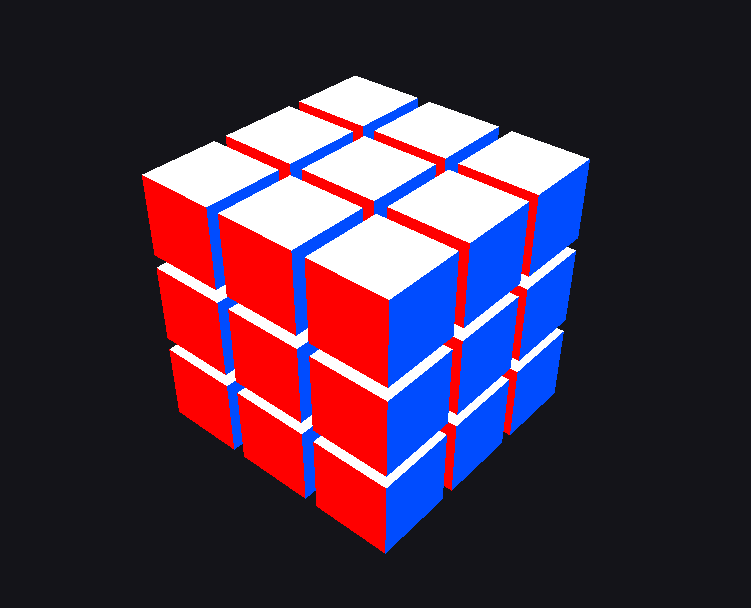

# 🧊 Rubik Cube OpenGL

3D визуализация кубика Рубика (3×3×3), реализованная на C++ с использованием OpenGL.

Проект демонстрирует послойное вращение кубика, интерактивное управление и работу с графикой в реальном времени.

---

## 🎮 Возможности

* Отрисовка кубика Рубика из 27 маленьких кубиков
* Послойное вращение по осям X, Y, Z
* Плавная анимация поворотов (90°)
* Управление камерой мышью
* Подсветка выбранного слоя
* Поддержка вращения в обе стороны

---

## 🎹 Управление

| Клавиша           | Действие                 |
| ----------------- | ------------------------ |
| `1 / 2 / 3`       | Выбор слоя (-1 / 0 / +1) |
| `Q`               | Вращение слоя по оси X   |
| `W`               | Вращение слоя по оси Y   |
| `E`               | Вращение слоя по оси Z   |
| `Shift + Q/W/E`   | Обратное вращение        |
| 🖱 ЛКМ + движение | Вращение камеры          |
| `Esc`             | Выход                    |

---

## 🖥️ Скриншот



---

## ⚙️ Используемые технологии

* C++
* OpenGL 3.3
* GLFW — создание окна и ввод
* GLAD — загрузка OpenGL функций
* GLM — математика (матрицы, векторы)

---

## 📁 Структура проекта

```
RubikCube/
│
├── main.cpp
├── glad.c
├── include/        # GLAD (заголовки)
├── glfw/           # GLFW (include + lib)
├── glm/            # GLM (header-only)
└── RubikCube.sln
```

---

## 🚀 Запуск проекта

### 🔹 В Visual Studio

1. Открыть файл `RubikCube.sln`
2. Выбрать конфигурацию:

   * `Debug` или `Release`
   * `x64`
3. Нажать **Build → Build Solution**
4. Запустить:

   * `F5` или `Ctrl + F5`

---

## 📦 Запуск через .exe

После сборки файл находится здесь:

```
x64/Release/RubikCube.exe
```

Если программа не запускается на другом ПК:

* убедитесь, что рядом есть `glfw3.dll` (если используется динамическая версия)

---

## 🧠 Особенности реализации

* Каждый элемент кубика (cubie) хранит:

  * свою позицию в сетке
  * матрицу ориентации
* При вращении:

  * изменяется логическая позиция
  * обновляется ориентация через матрицы
* Анимация выполняется плавно от 0 до 90 градусов

---

## 📌 Возможные улучшения

* Добавить текстуры вместо однотонных цветов
* Реализовать перемешивание (scramble)
* Добавить сборку мышью
* Подсветка границ слоя (outline)
* Камера с зумом (scroll)

---

## 📄 Лицензия

Свободное использование в учебных целях
